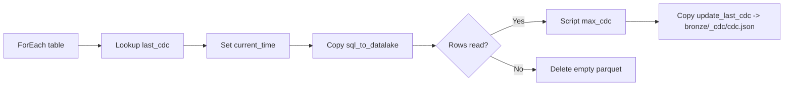
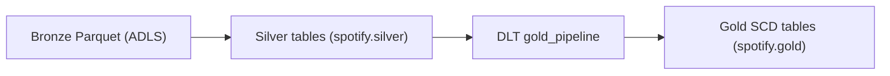

# Azure Spotify Data Engineering (IaC)

Terraform-first infrastructure for a Spotify data engineering project using the medallion architecture (bronze/silver/gold).

## Quick Start
1) Install prerequisites:
   - Azure CLI (az)
   - Terraform (>= 1.5)
   - Python 3.10+

2) Authenticate to Azure:
```powershell
az login
az account show
```

3) Deploy infrastructure:
```powershell
python scripts\deploy.py
```

For SQL deployments, Entra admin login defaults to the current Azure CLI user if omitted. Password and public IP are auto-generated/detected if omitted:
```powershell
$env:SQL_ADMIN_LOGIN = "sqladmin"
$env:AZUREAD_ADMIN_LOGIN = "your.name@domain.com"
```
Auto-generated values are written to `terraform/03_sql_database/terraform.tfvars` (gitignored).

For Databricks Unity Catalog automation, add a `.env` file (gitignored):
```
DATABRICKS_ACCOUNT_ID=...
DATABRICKS_CLIENT_ID=...
DATABRICKS_CLIENT_SECRET=...
DATABRICKS_WORKSPACE_USER=you@domain.com
```

If you run Terraform manually instead of the script, set `TF_VAR_databricks_account_id`, `TF_VAR_databricks_client_id`, and `TF_VAR_databricks_client_secret` or keep `terraform/10_databricks_uc/terraform.tfvars` around.

To push workspace content with `scripts/push_databricks_workspace.py`, install the Databricks CLI. The script loads `.env`, detects the workspace host, and uses OAuth M2M when the Databricks client ID/secret are set, so you do not need an interactive login.

## Project Structure
- terraform/01_resource_group: Azure resource group
- terraform/02_storage_account: ADLS Gen2 storage account + medallion containers
- terraform/03_sql_database: Azure SQL Server + dev database
- terraform/04_data_factory: Azure Data Factory v2
- terraform/05_adf_linked_services: ADF linked services (SQL + ADLS Gen2)
- terraform/06_adf_pipeline_incremental_arm: ADF datasets + incremental ingestion pipeline (ARM/azapi)
- terraform/07_monitoring: Azure Monitor alerts (Log Analytics + Action Group email)
- terraform/08_databricks: Azure Databricks workspace (Premium)
- terraform/09_databricks_access_connector: Databricks access connector + Storage Blob Data Contributor role
- terraform/10_databricks_uc: Unity Catalog catalog/schema + storage credential + external locations
- spotify_dab/src/silver: Example silver notebooks included in the DBC
- spotify_dab/src/gold: Gold pipeline code (DLT transformations)
- scripts/: Deploy/destroy helpers (auto-writes terraform.tfvars)
- guides/setup.md: Detailed setup guide
- data_scripts/: SQL/scripts for data loading

## Deploy/Destroy Options
Deploy specific stacks:
```powershell
python scripts\deploy.py --rg-only
python scripts\deploy.py --storage-only
python scripts\deploy.py --sql-only
python scripts\deploy.py --datafactory-only
python scripts\deploy.py --adf-links-only
python scripts\deploy.py --adf-pipeline-only
python scripts\deploy.py --monitoring-only
python scripts\deploy.py --databricks-only
python scripts\deploy.py --databricks-access-connector-only
python scripts\deploy.py --uc-only
python scripts\deploy.py --db-import-only
python scripts\deploy.py --db-import-only --databricks-profile spotify
python scripts\deploy.py --sql-only --sql-init
python scripts\deploy.py --skip-sql-init
python scripts\deploy.py --skip-adf-git-check
python scripts\deploy.py --skip-dbc-import
```
Full deploys use the ARM/azapi pipeline module (`incremental_ingestion_arm`) by default.
`--sql-init` runs `data_scripts/spotify_initial_load.sql` using `sqlcmd`.
Full deploys run the SQL init step unless `--skip-sql-init` is provided.
The ADF step prompts you to confirm GitHub linking unless `--skip-adf-git-check` is provided.

Install `sqlcmd`:
```powershell
winget install Microsoft.Sqlcmd
```

```powershell
choco install sqlcmd -y
```

```bash
brew install sqlcmd
```

```bash
curl -sSL https://packages.microsoft.com/keys/microsoft.asc | sudo tee /etc/apt/trusted.gpg.d/microsoft.asc >/dev/null
curl -sSL https://packages.microsoft.com/config/ubuntu/22.04/prod.list | sudo tee /etc/apt/sources.list.d/microsoft-prod.list >/dev/null
sudo apt-get update
sudo apt-get install -y sqlcmd
```

```bash
sudo rpm --import https://packages.microsoft.com/keys/microsoft.asc
curl -sSL https://packages.microsoft.com/config/rhel/9/prod.repo | sudo tee /etc/yum.repos.d/microsoft-prod.repo
sudo yum install -y sqlcmd
```

## Git Integrations
- Azure Data Factory and Azure Databricks Git linking is manual. See `guides/setup.md` for detailed steps.

## ADF Linked Services
Linked services for SQL and ADLS Gen2 are created via Terraform in `terraform/05_adf_linked_services`.

## ADF Incremental Pipeline
Datasets and the incremental ingestion pipeline are created via Terraform. The ARM/azapi module in `terraform/06_adf_pipeline_incremental_arm` sets `loop_input` defaults from `data_scripts/loop_input.json`.
The pipeline writes the latest CDC value (max from the source table) back into `bronze/<table>_cdc/cdc.json`. The seeded value starts as `{"cdc":"1900-01-01"}`, and after a successful run it becomes the newest CDC value from the table, e.g. `{"cdc":"2025-10-07T19:49:56"}`.
Alerting is handled by the Azure Monitor module, not by a pipeline Web activity.



## ADLS Seed Files
The storage module uploads `data_scripts/cdc.json` and `data_scripts/empty.json` into `bronze/<table>_cdc` for each table in the loop input file.
It also creates `silver/DimUser`, `silver/DimUser/data`, and `silver/DimUser/checkpoint`.

## Azure Monitor Alerts
The monitoring module (`terraform/07_monitoring`) sets up Log Analytics diagnostics for ADF pipeline runs and sends Action Group emails for both success and failure.
Alerts run every 5 minutes and only send an email if a matching run occurred within the last 5 minutes.

## Azure Databricks
The Databricks workspace is provisioned by `terraform/08_databricks` with the Premium SKU and an auto-named managed resource group.

## Databricks Access Connector
The access connector module (`terraform/09_databricks_access_connector`) creates a managed identity and assigns it the Storage Blob Data Contributor role on the storage account.

## Databricks Workspace Content
Project assets are packaged into `databricks_workspace/spotify_dab.dbc` and imported into the user workspace path.
Set `DATABRICKS_WORKSPACE_USER` (or `AZUREAD_ADMIN_LOGIN`) in `.env` so scripts can resolve `/Users/<user-email>/spotify_dab`.

To import the DBC (use `--profile` if you rely on a saved Databricks CLI profile):
```
python scripts/import_databricks_dbc.py --target /Users/<user-email>/spotify_dab
```
To import in one step:
```
python scripts\deploy.py --db-import-only --databricks-profile spotify
```

Full deploys also import `databricks_workspace/spotify_dab.dbc` into `/Users/<user-email>/spotify_dab` (and replace it) unless you pass `--skip-dbc-import`. When `--databricks-profile` is set, the deploy script runs `databricks auth login` against the current workspace host before importing.

## Building the spotify_dab DBC (Manual)
Export the DBC from the workspace project root (avoid the `.bundle` folder to keep paths clean):
```powershell
databricks workspace export --format DBC /Users/<user>/spotify_dab databricks_workspace\spotify_dab.dbc --profile spotify
```
If the UI ZIP export fails, use a directory export and zip locally:
```powershell
databricks workspace export-dir /Users/<user>/spotify_dab local_spotify_dab --profile spotify
```

## Databricks Gold Pipeline (Manual)
Gold layer DLT transformations live in `spotify_dab/src/gold/transformations`. The sample silver notebooks (including the Jinja example) live in `spotify_dab/src/silver` and are packaged into the DBC.

To create the Lakeflow pipeline in Databricks:
1) Create a new pipeline named `gold_pipeline`.
2) Choose "Start with sample code in Python" (Lakeflow Pipelines Editor ON).
3) Set the target catalog to `spotify` and schema to `gold`.
4) Add the code from `spotify_dab/src/gold` as pipeline assets.

This pipeline is created manually and included in the `spotify_dab.dbc` bundle; it is not provisioned by Terraform.



## Databricks Unity Catalog (Automation)
The Unity Catalog module (`terraform/10_databricks_uc`) creates:
- Catalog: `spotify`
- Schemas: `silver`, `gold`
- Storage credential (managed identity via the access connector)
- External locations for bronze, silver, and gold containers

By default, the catalog managed location uses the silver container. Override it by setting `catalog_storage_root` in `terraform/10_databricks_uc/terraform.tfvars`.

The deploy script reads Databricks OAuth credentials from `.env` and writes them to the UC module's `terraform.tfvars` (gitignored):
```
DATABRICKS_ACCOUNT_ID=...
DATABRICKS_CLIENT_ID=...
DATABRICKS_CLIENT_SECRET=...
```
See `guides/setup.md` for the Databricks Account Console steps (service principal, admin role, OAuth secret).

Destroy:
```powershell
python scripts\destroy.py
```

## Guide
See guides/setup.md for detailed instructions.
