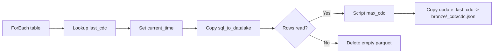

# Project Setup Guide

This project provisions Azure resources using Terraform and includes helper scripts.

## Prerequisites
- Azure CLI (az) installed and authenticated
- Terraform installed (>= 1.5)
- Python 3.10+ (for running the helper scripts)

## Azure CLI
Check your Azure CLI and login status:

```powershell
az --version
az login
az account show
```

If you need to switch subscriptions:

```powershell
az account list --output table
az account set --subscription "<subscription-id-or-name>"
az account show
```

## Terraform Setup
Check if Terraform is installed and on PATH:

```powershell
terraform version
```

Install or update Terraform on Windows:

```powershell
winget install HashiCorp.Terraform
```

```powershell
choco install terraform -y
```

After installing, re-open PowerShell and re-run terraform version.

## Project Structure
- terraform/01_resource_group: Azure resource group
- terraform/02_storage_account: ADLS Gen2 storage account + medallion containers
- terraform/03_sql_database: Azure SQL Server + dev database
- terraform/04_data_factory: Azure Data Factory v2
- terraform/05_adf_linked_services: ADF linked services (SQL + ADLS Gen2)
- terraform/06_adf_pipeline_incremental_arm: ADF datasets + incremental ingestion pipeline (ARM/azapi)
- terraform/07_monitoring: Azure Monitor alerts (Log Analytics + Action Group email)
- terraform/08_databricks: Azure Databricks workspace (Premium)
- terraform/09_databricks_access_connector: Databricks access connector + Storage Blob Data Contributor role
- terraform/10_databricks_uc: Unity Catalog catalog/schema + storage credential + external locations
- spotify_dab/src/silver: Example silver notebooks included in the DBC
- spotify_dab/src/gold: Gold pipeline code (DLT transformations)
- scripts/: Helper scripts to deploy/destroy Terraform resources

## Configure Terraform
The deploy script writes terraform.tfvars files automatically.
If you want different defaults, edit DEFAULTS in scripts/deploy.py before running.

For the SQL stack, Entra admin login defaults to the current Azure CLI user if omitted. The SQL password and client IP are auto-generated/detected if omitted:
```powershell
$env:SQL_ADMIN_LOGIN = "sqladmin"
$env:AZUREAD_ADMIN_LOGIN = "your.name@domain.com"
```

Optional overrides:
```powershell
$env:SQL_ADMIN_PASSWORD = "UseAStr0ng!Passw0rd"
$env:SQL_CLIENT_IP = "<your-public-ip>"
```

## Deploy Resources
From the repo root or scripts folder, run:

```powershell
python scripts\deploy.py
```

Optional flags:

```powershell
python scripts\deploy.py --rg-only
python scripts\deploy.py --storage-only
python scripts\deploy.py --sql-only
python scripts\deploy.py --datafactory-only
python scripts\deploy.py --adf-links-only
python scripts\deploy.py --adf-pipeline-only
python scripts\deploy.py --monitoring-only
python scripts\deploy.py --databricks-only
python scripts\deploy.py --databricks-access-connector-only
python scripts\deploy.py --uc-only
python scripts\deploy.py --db-import-only
python scripts\deploy.py --db-import-only --databricks-profile spotify
python scripts\deploy.py --skip-dbc-import
python scripts\deploy.py --sql-only --sql-init
python scripts\deploy.py --skip-sql-init
python scripts\deploy.py --skip-adf-git-check
```
Note: `--adf-pipeline-only` deploys the ARM/azapi pipeline module.

## Azure Data Factory GitHub Linking (Manual)
Terraform does not configure ADF Git integration. After ADF is created, link it in ADF Studio:

1) Open ADF Studio for your factory.
2) Go to Manage (wrench icon) -> Git configuration -> Configure.
3) Select GitHub and set (replace with your own org/repo as needed; values below are examples):
   - Repository type: GitHub
   - GitHub account: Ch3rry-Pi3-Data-Engineering (example)
   - Repository name: DataEng-Azure-Spotify (example)
   - Collaboration branch: main
   - Publish branch: adf_publish
   - Root folder: /
   - Publish (from ADF Studio): Enabled
   - Custom comment: Enabled
4) Save and publish.

### OAuth App Restrictions Bootstrap (GitHub Orgs)
If your GitHub org enforces OAuth app restrictions, you must allow a first-time OAuth handshake.

One-time bootstrap flow:
1) GitHub org settings -> Third-party access -> OAuth app policy -> temporarily disable "Restrict third-party application access".
2) In ADF Studio, connect the repo (this registers the AzureDataFactory OAuth app).
3) Re-enable "Restrict third-party application access".
4) GitHub user settings -> Applications -> Authorized OAuth Apps -> AzureDataFactory -> grant org access.

Notes:
- OAuth apps do not appear for approval until they authenticate once.
- With restrictions enabled, that first authentication is blocked.
- This is expected GitHub behavior.

## Azure Databricks GitHub Linking (Manual)
Use a GitHub personal access token (PAT) and link it in Databricks:

1) Create a GitHub PAT:
   - GitHub -> Settings -> Developer settings -> Personal access tokens.
   - Use scopes: repo (private) or public_repo (public only).
   - If your org requires SSO, authorize the token for the org.
2) In Databricks, open your workspace.
3) Click your user profile -> Settings -> Git Integration.
4) Add Git provider = GitHub and paste the PAT.
5) In Repos, click "Add Repo", paste the repo URL, and create.

## Databricks Admin Access & MFA
Databricks sign-in follows the Entra ID user you log in with. To avoid relying on someone else’s MFA device:
- Create or use your own Entra ID user.
- Add that user as an account admin or workspace admin in the Databricks Account Console.
- Enroll MFA for that user on your own device.

Storage access for the medallion containers is handled by the Databricks access connector (managed identity), so you do not need a service principal or Key Vault for basic read/write access.

## Databricks Unity Catalog Automation
Unity Catalog objects are created via Terraform in `terraform/10_databricks_uc`. This requires a Databricks account service principal with an OAuth secret.
The module creates catalog `spotify`, schemas `silver` + `gold`, a managed identity storage credential, and external locations for bronze/silver/gold.

1) Open the Databricks Account Console: `https://accounts.azuredatabricks.net`
2) Go to User management -> Service principals -> Add service principal.
3) Name it (example: `sp-databricks-admin`).
4) Roles tab: enable Account admin (or add it to the Admins group).
5) Permissions tab: grant your user Manage + Use.
6) Credentials & secrets tab: create an OAuth secret and copy the Client ID + Secret.
7) Create a `.env` file in the repo root (gitignored) and add:
```
DATABRICKS_ACCOUNT_ID=...
DATABRICKS_CLIENT_ID=...
DATABRICKS_CLIENT_SECRET=...
DATABRICKS_WORKSPACE_USER=you@domain.com
```
The deploy script auto-loads `.env` and writes the UC module's `terraform.tfvars` for you.
If you run Terraform directly, either keep `terraform/10_databricks_uc/terraform.tfvars` or export `TF_VAR_databricks_account_id`, `TF_VAR_databricks_client_id`, and `TF_VAR_databricks_client_secret` before running `terraform apply`.
By default, the catalog managed location uses the silver container. Override it by setting `catalog_storage_root` in `terraform/10_databricks_uc/terraform.tfvars`.

Deploy Unity Catalog only:
```powershell
python scripts\deploy.py --uc-only
```

## Databricks Workspace Content
Project assets are packaged into `databricks_workspace/spotify_dab.dbc` and imported into the user workspace path.
Set `DATABRICKS_WORKSPACE_USER` (or `AZUREAD_ADMIN_LOGIN`) in `.env` so scripts can resolve `/Users/<user-email>/spotify_dab`.

To import a DBC export (use `--profile` if you rely on a saved Databricks CLI profile):
```powershell
python scripts/import_databricks_dbc.py --target /Users/<user-email>/spotify_dab
```
To import in one step:
```powershell
python scripts\deploy.py --db-import-only --databricks-profile spotify
```

Full deploys also import `databricks_workspace/spotify_dab.dbc` into `/Users/<user-email>/spotify_dab` (and replace it) unless you pass `--skip-dbc-import`. When `--databricks-profile` is set, the deploy script runs `databricks auth login` against the current workspace host before importing.

## Building the spotify_dab DBC (Manual)
Export the DBC from the workspace project root (avoid the `.bundle` folder to keep paths clean):
```powershell
databricks workspace export --format DBC /Users/<user>/spotify_dab databricks_workspace\spotify_dab.dbc --profile spotify
```
If the UI ZIP export fails, use a directory export and zip locally:
```powershell
databricks workspace export-dir /Users/<user>/spotify_dab local_spotify_dab --profile spotify
```

## Databricks Gold Pipeline (Manual)
Gold layer DLT transformations live in `spotify_dab/src/gold/transformations`. The sample silver notebooks (including the Jinja example) live in `spotify_dab/src/silver` and are packaged into the DBC.

To create the Lakeflow pipeline in Databricks:
1) Create a new pipeline named `gold_pipeline`.
2) Choose "Start with sample code in Python" (Lakeflow Pipelines Editor ON).
3) Set the target catalog to `spotify` and schema to `gold`.
4) Add the code from `spotify_dab/src/gold` as pipeline assets.

This pipeline is created manually and included in the `spotify_dab.dbc` bundle; it is not provisioned by Terraform.

```mermaid
graph LR
    B[Bronze Parquet (ADLS)] --> S[Silver tables (spotify.silver)]
    S --> P[DLT gold_pipeline]
    P --> G[Gold SCD tables (spotify.gold)]
```

## Azure Data Factory Linked Services (Terraform)
The SQL and ADLS Gen2 linked services are created by Terraform in `terraform/05_adf_linked_services`.

Defaults:
- Linked service name: `lsqldb-spotify-dev` (override via DEFAULTS in `scripts/deploy.py`).
- Server/database: pulled from SQL module outputs.
- Authentication: SQL auth using the SQL admin login/password from `terraform/03_sql_database/terraform.tfvars`.
- Subscription: uses the current Azure CLI context (default subscription).
- ADLS Gen2 linked service name: `lsadls-spotify` (override via DEFAULTS in `scripts/deploy.py`).
- ADLS Gen2 auth: account key from `terraform/02_storage_account` outputs.

If you want a different linked service name or SQL login, update `scripts/deploy.py` or the generated `terraform/05_adf_linked_services/terraform.tfvars`.

### Import Terraform Resources into Git Mode
Terraform creates ADF resources (linked services, datasets, pipelines) in Live mode. To bring them into Git mode:
1) Switch to Git mode (top bar, branch selector next to the GitHub icon).
2) Click "Import resources" (top bar).
3) Select the linked service(s), datasets, and pipelines from Live mode and import.
4) Publish to `adf_publish`.

Note: `adf_publish` is an auto-generated branch created by ADF when you publish. It is not meant to be merged into `main` and will be recreated if deleted.

## Incremental Ingestion Pipeline
The incremental pipeline is created by Terraform. The ARM/azapi module (`incremental_ingestion_arm`) sets the default value from `data_scripts/loop_input.json`.

The `incremental_ingestion` pipeline expects a single parameter:
- `loop_input` (Array). The default is pulled from `data_scripts/loop_input.json`; each item must include `schema`, `table`, `cdc_col`, and `from_date`.
  - `from_date` is optional; when empty, the pipeline uses the CDC lookup file for that table.
  - Use a SQL-friendly format, e.g. `2026-01-04` or `2026-01-04T22:02:03.6147312` (no trailing `Z`).

The pipeline flow is:
1) For each item in `loop_input`, lookup `bronze/<table>_cdc/cdc.json` (JSON array) to get the last CDC value.
2) Set variable `current` to `@utcNow()` for file naming.
3) Copy SQL data to Parquet in `bronze/<table>/<table>_<current>`.
4) If data was read, query max CDC and overwrite `bronze/<table>_cdc/cdc.json`. If no rows, delete the empty Parquet file.

Alerting is handled by the Azure Monitor module instead of pipeline activities.

The delete activity requires logging settings with the ADLS linked service (configured in Terraform).
The CDC file starts at `{"cdc":"1900-01-01"}` and is overwritten with the max CDC value from the table after a successful run, e.g. `{"cdc":"2025-10-07T19:49:56"}`.



Default loop input lives in `data_scripts/loop_input.json`. Terraform writes it as the default value; override it for a smaller debug run:
```
[
  {
    "schema": "dbo",
    "table": "DimUser",
    "cdc_col": "updated_at",
    "from_date": "2025-01-01"
  }
]
```

Test runs:
- With `from_date` set, the pipeline uses that value for the CDC filter.
- With `from_date` empty, the pipeline uses the last CDC value from the lookup file.

## Azure Monitor Alerts (Log Analytics + Action Group)
The monitoring module creates a Log Analytics workspace, configures ADF diagnostics for PipelineRuns, and sends Action Group emails on success and failure.

1) Deploy monitoring:
```powershell
python scripts\deploy.py --monitoring-only
```

Notes:
- Default recipient is `the_rfc@hotmail.co.uk` (override via `terraform/07_monitoring/terraform.tfvars`).
- Alerts run every 5 minutes and only fire if at least one matching run occurred in the last 5 minutes.

## Seed the SQL Database
To run `data_scripts/spotify_initial_load.sql` against the new database:
```powershell
python scripts\deploy.py --sql-only --sql-init
```

This step uses `sqlcmd`. Install it if needed:
```powershell
winget install Microsoft.Sqlcmd
```

```powershell
choco install sqlcmd -y
```

macOS:
```bash
brew install sqlcmd
```

Ubuntu/Debian:
```bash
curl -sSL https://packages.microsoft.com/keys/microsoft.asc | sudo tee /etc/apt/trusted.gpg.d/microsoft.asc >/dev/null
curl -sSL https://packages.microsoft.com/config/ubuntu/22.04/prod.list | sudo tee /etc/apt/sources.list.d/microsoft-prod.list >/dev/null
sudo apt-get update
sudo apt-get install -y sqlcmd
```

RHEL/CentOS:
```bash
sudo rpm --import https://packages.microsoft.com/keys/microsoft.asc
curl -sSL https://packages.microsoft.com/config/rhel/9/prod.repo | sudo tee /etc/yum.repos.d/microsoft-prod.repo
sudo yum install -y sqlcmd
```

If you did not set `SQL_ADMIN_PASSWORD`, read it from `terraform/03_sql_database/terraform.tfvars`.

## Destroy Resources
To tear down resources:

```powershell
python scripts\destroy.py
```

Optional flags:

```powershell
python scripts\destroy.py --rg-only
python scripts\destroy.py --storage-only
python scripts\destroy.py --sql-only
python scripts\destroy.py --datafactory-only
python scripts\destroy.py --adf-links-only
python scripts\destroy.py --adf-pipeline-only
python scripts\destroy.py --monitoring-only
python scripts\destroy.py --databricks-only
python scripts\destroy.py --databricks-access-connector-only
python scripts\destroy.py --uc-only
python scripts\destroy.py --db-import-only --databricks-profile spotify
```
`--db-import-only` deletes `/Users/<user-email>/spotify_dab`.

## Notes
- Storage account names must be 3-24 characters and lowercase letters/numbers.
- The storage account is created with hierarchical namespace enabled (ADLS Gen2).
- Default containers include bronze/silver/gold.
- The deploy script creates bronze, silver, and gold containers for the medallion architecture.
- The storage module uploads data_scripts/cdc.json and data_scripts/empty.json into bronze/<table>_cdc for each table in data_scripts/loop_input.json (or loop_input.txt).
- The storage module creates silver/DimUser, silver/DimUser/data, and silver/DimUser/checkpoint.
- Storage replication defaults to LRS (locally redundant storage).
- SQL admin credentials are read from env vars, or auto-generated and saved to terraform/03_sql_database/terraform.tfvars.
- The SQL server allows Azure services and the detected or provided client IP address.
- Full deploys run SQL init unless --skip-sql-init is provided.
- The deploy script prompts for ADF Git linking unless --skip-adf-git-check is provided.
- terraform.tfvars files are generated and are gitignored.
